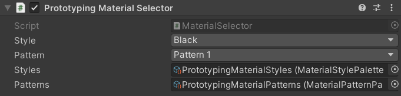

# Materials

The **Prototyping Kit** includes various materials for prototyping purposes, including checkerboard patterns, grid patterns, and more. Most of the materials are rendered using Unity's standard shader, but there is also an included shader for drawing checkerboard patterns, and one for mapping a cubemap texture onto an object.

## 💈 Styles and Patterns

Many of the prefabs included in the package are configured with a [Material Selector](/api/Zigurous.Prototyping/MaterialSelector) script that allows you to customize an object's material using various style and pattern presets. By default, there are 20 styles and 14 different patterns to choose from.

A style is defined by color, metallic, and smoothness values. A pattern is defined by a texture (see the [Textures](/manual/textures) manual). You can also create your own palettes from the asset creation menu `Assets > Create > Zigurous > Prototyping` in the Unity editor.

