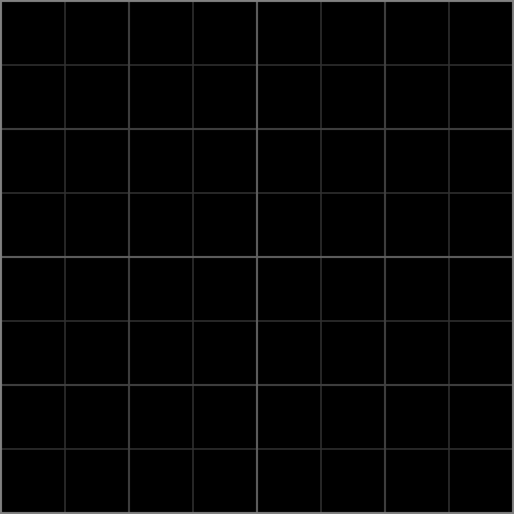
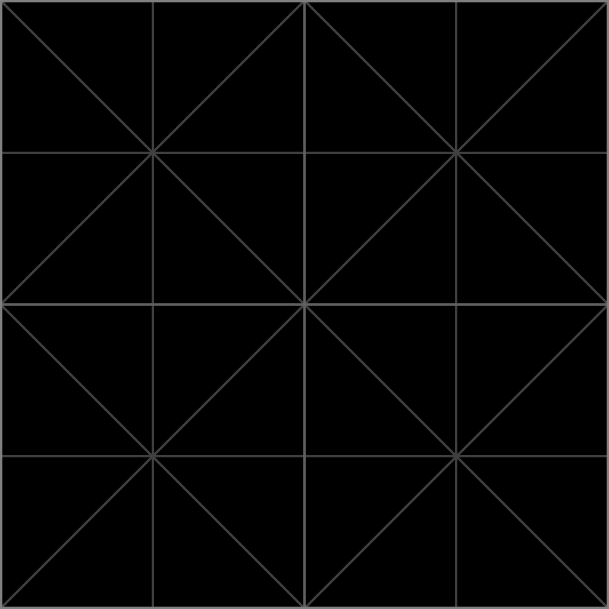
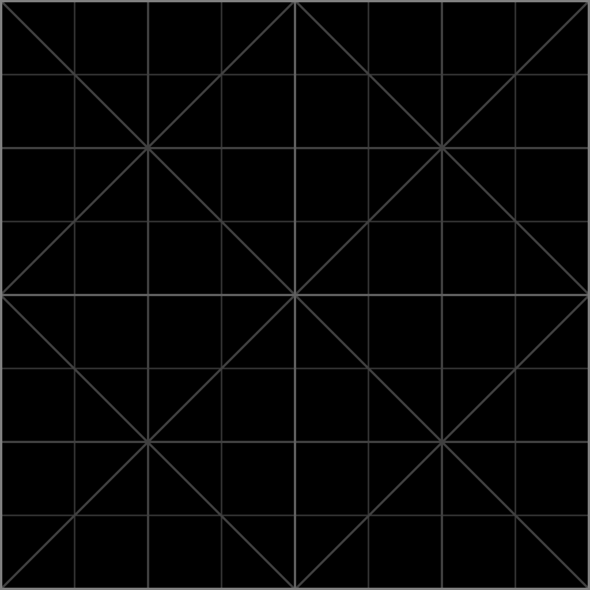
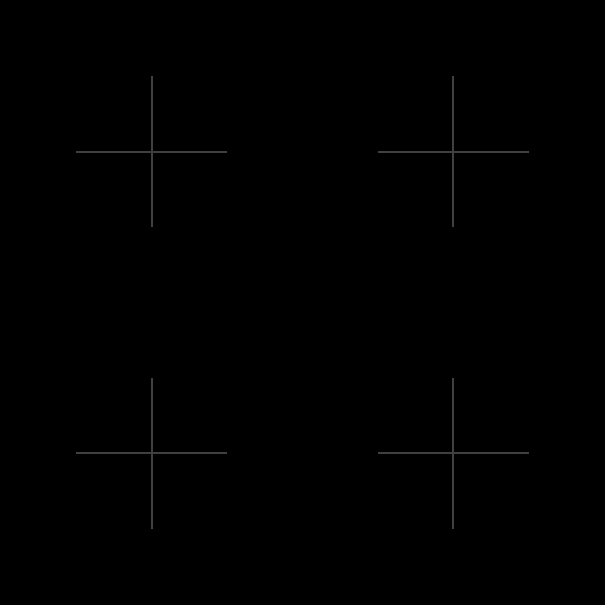
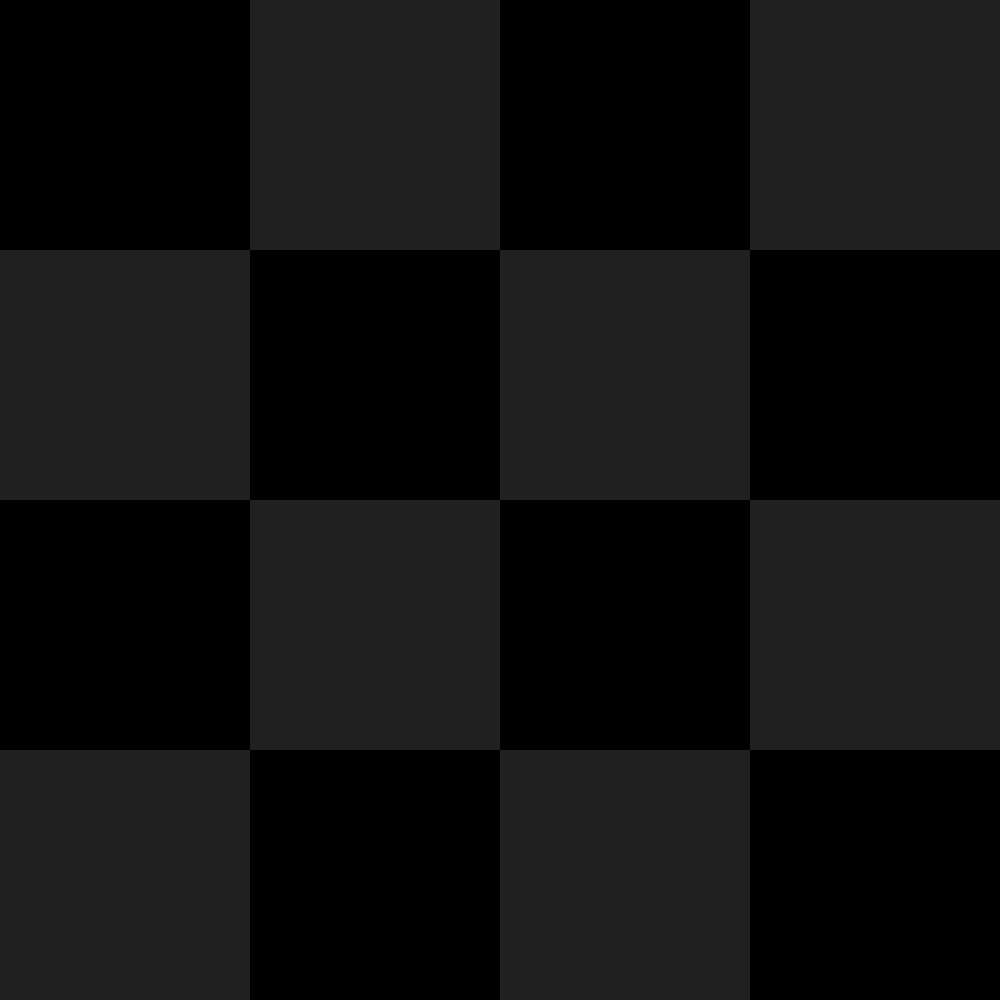
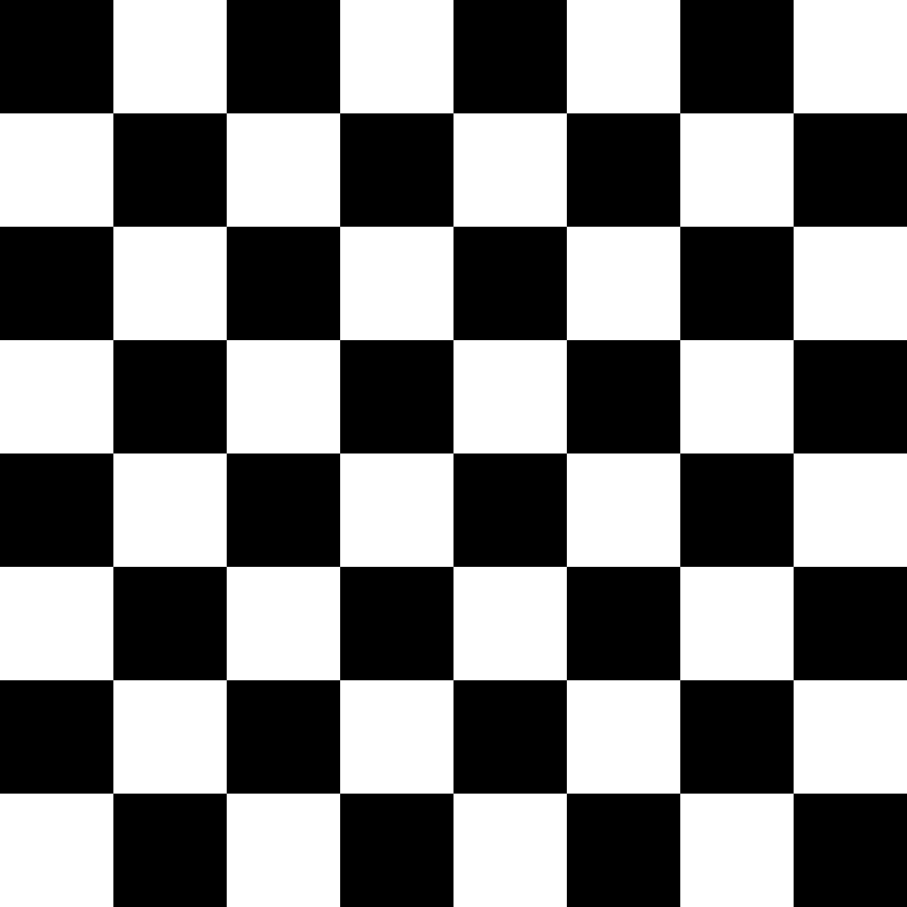

# Textures

The **Prototyping Kit** includes over a dozen different texture variants. Most of these are grid and checkerboard patterns. The grid patterns are intended to be used as emission maps so the grid lines are still visible in dark environments. Changing the emission color will change the overall color of the texture. The other textures can be used normally as the main texture of a material.

## 🖼️ Images

 

 

 

